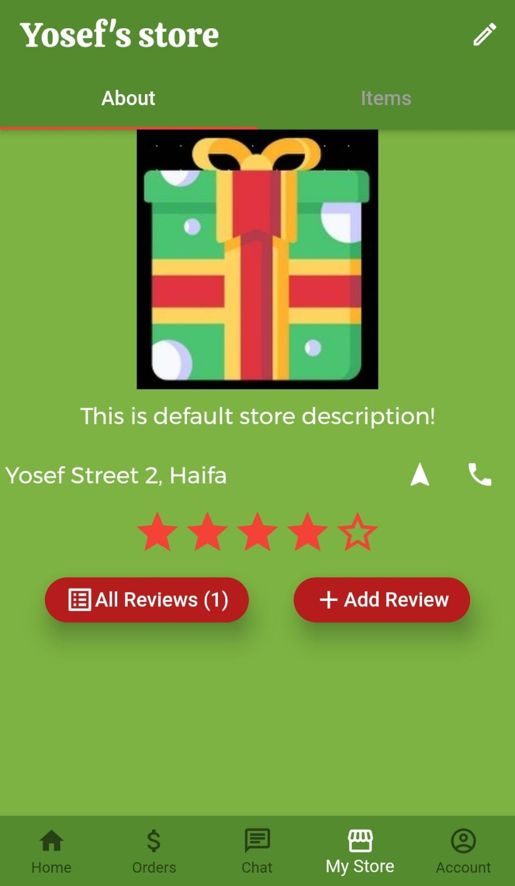
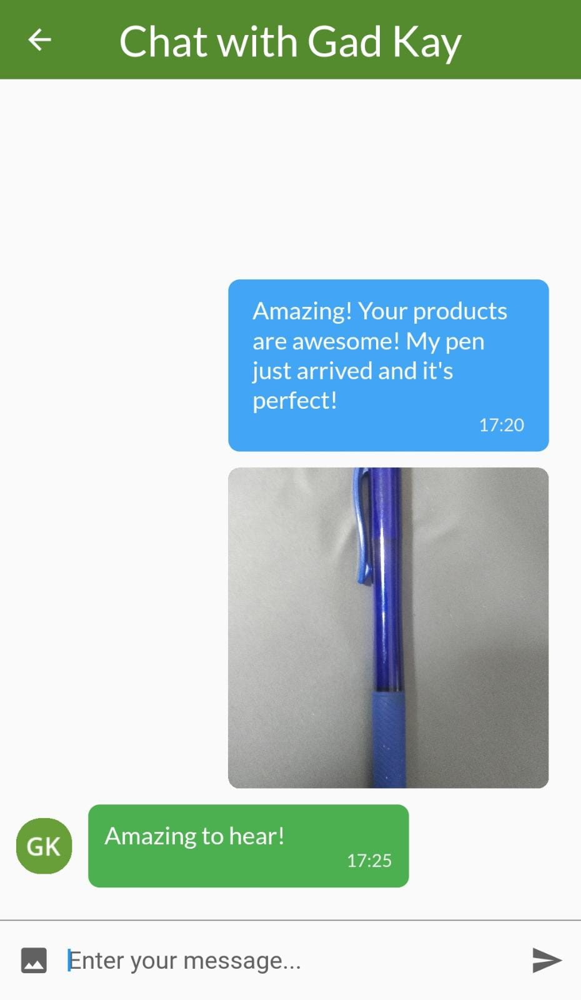
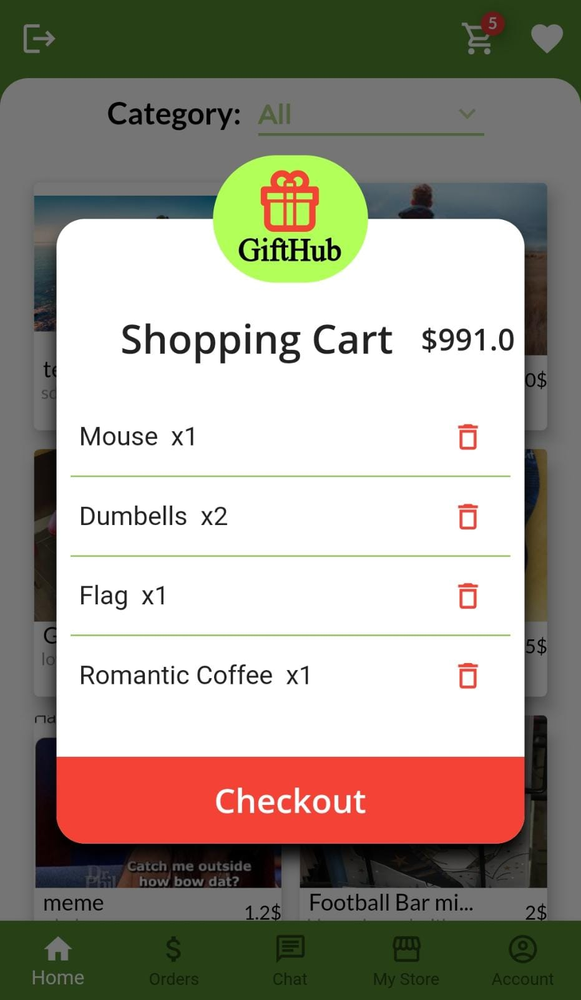

# GiftHub

A social and user-friendly app for buying and selling romantic gifts :heart:

    

## Motivation

* *For many people, buying the perfect gift for their loved ones might be as tough as maintaining a relationship. Nowadays, as new trending, romantic gifts emerge, people often don't know what to buy and where to find it. We want to establish an interactive platform so that YOU will always keep your loved ones happy :smiley:*

## Core Features

* [ ] Filter gifts by categories and price.
* [ ] Buy and sell gifts on an easy, interactive platform.
* [ ] Write reviews to share your experience with other users.
* [ ] Save your favorite products for later in a wish list.
* [ ] Interact with sellers via chat messages.

## Complementary features

* [ ] Sign up and login with Google or your e-mail.
* [ ] Visit as a guest.
* [ ] Design your own store, upload your amazing products keep track of them!
* [ ] Share your favourite gifts with friends.
* [ ] Navigate or call a seller as easy as pressing a button!
* [ ] Receive notifications when someone sends you a message.
* [ ] Add an extra layer of protection with your fingerprint!
* [ ] Manage your profile with extreme ease, and even choose your address with a map interface!

## Table of Contents
1. [Application structure](docs/applicationstracture2.md)
2. [Firebase structure](docs/FirebaseStructure2.md)

# Disclaimer

Google Play and the Google Play logo are trademarks of Google LLC.

