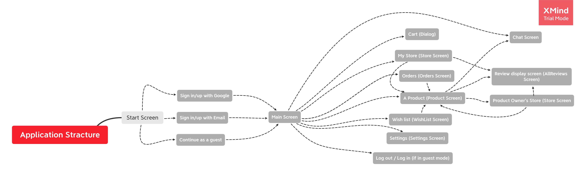

# List of screens:

## Start Screen

## Sign in/up with Google

## Main Screen

## Sign in/up with Email

## Continue as a guest

## A Product (Product Screen)

## Log out / Log in (if in guest mode)

## Orders (Orders Screen)

## My Store (Store Screen)

## Cart (Dialog)

## Review display screen (AllReviews Screen)

## Product Owner's Store (Store Screen

## Wish list (WishList Screen)

## Settings (Settings Screen)
